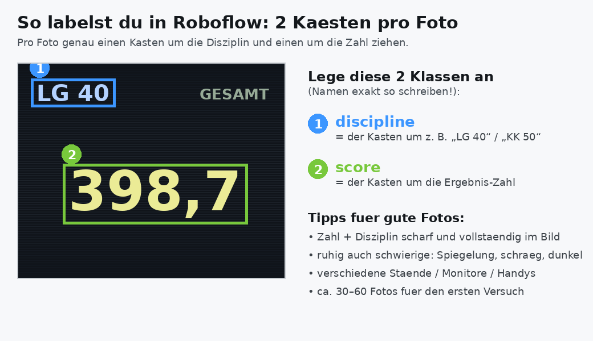

# 📸 Anleitung: Fotos für das KI-Training sammeln & labeln

Damit die Foto-KI noch besser wird, braucht sie echte Beispiele. Diese Anleitung
führt dich durch die zwei Schritte, die **nur du** machen kannst – Fotografieren
und Labeln. Den Rest (Training, Einbau) übernimmt Claude.

> Zum reinen Ausprobieren **ohne Fotos**: im Trainings-Notebook einfach
> „Variante A (Synthetik)" nehmen. Dann kannst du diese Anleitung überspringen.

---

## Schritt 1 – Fotos machen

Fotografiere mit dem Handy echte **Trefferanlagen-Monitore** (die Anzeige mit
Disziplin und Ergebnis).

**Checkliste für gute Trainingsfotos:**
- ✅ Disziplin (z. B. „LG 40") **und** die Ergebnis-Zahl klar im Bild
- ✅ scharf und vollständig – nichts abschneiden
- ✅ bewusst auch **schwierige** Aufnahmen: Spiegelung/Glare, schräg, dunkel, hell
- ✅ **Abwechslung**: verschiedene Stände, Monitore, Lichtverhältnisse, Handys
- 🎯 **Menge**: ca. **30–60 Fotos** für den ersten Versuch (mehr = besser)

Je vielfältiger die Fotos, desto robuster wird die KI im echten Einsatz.

---

## Schritt 2 – Labeln auf [roboflow.com](https://roboflow.com)

Roboflow ist kostenlos. Du ziehst pro Foto **genau zwei Kästen** und benennst sie:

1. Kostenloses Konto anlegen → **Create Project** → Typ **Object Detection**.
2. Deine Fotos hochladen.
3. Lege **genau diese zwei Klassen** an (Namen exakt, klein geschrieben!):
   - **`discipline`** – Kasten um die Disziplin (z. B. „LG 40", „KK 50", „KK 3x20")
   - **`score`** – Kasten um die Ergebnis-Zahl (z. B. „398,7", „578")
4. In jedem Foto beide Kästen ziehen. (Pro Foto je ein `discipline`- und ein `score`-Kasten.)
5. Wenn alle gelabelt sind: **Generate** → **Export Dataset** → Format **YOLOv11**
   → **„show download code"**. Roboflow zeigt dir einen kurzen Code-Schnipsel
   (mit `pip install roboflow …`). Den brauchst du gleich.

> ⚠️ Die Klassennamen **müssen** `discipline` und `score` heißen – exakt so.
> Daran erkennt die App die beiden Bereiche wieder.

---

## Schritt 3 – Trainieren (Colab, klickt sich von allein)

1. Notebook [`notebooks/train-vision-model.ipynb`](../notebooks/train-vision-model.ipynb)
   in [Google Colab](https://colab.research.google.com/) öffnen.
2. Oben **Laufzeit → Laufzeittyp ändern → GPU** wählen.
3. Bei **Schritt 2 → Variante B** den Roboflow-Schnipsel aus Schritt 2 oben einfügen.
4. Alle Zellen der Reihe nach mit ▶ ausführen.
5. Am Ende lädt sich **`vision_model_dropin.zip`** herunter.

---

## Schritt 4 – Fertig: ZIP an Claude geben

Schick Claude das `vision_model_dropin.zip` mit *„übernimm dieses Modell als
Drop-in"*. Claude baut es ins Repo ein, hebt Versionen an, testet und macht den
Rest. **Du tippst keine Zeile Code.**

---

### Tipp: noch weniger Label-Arbeit
Du kannst deine echten Fotos mit den **synthetischen** Bildern kombinieren
(Generator: `training/generate_synthetic_monitor.py`). Dann reichen schon
wenige echte Fotos für ein robustes Modell. Frag Claude, wenn du das möchtest.
